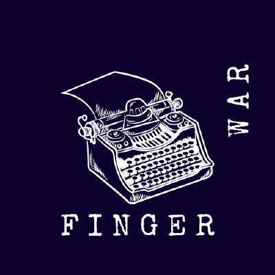

<a href="https://fingerwar.com.br">
  

    
  

</a>

  Fingerwar is a typing competition platform where you can have fun with your friends.

<a href="https://fingerwar.com.br"><strong><-- Start Typing --></strong></a>

  <a href="https://github.com/orgs/Finger-War/discussions">Discussions</a>
  ·
  <a href="https://github.com/Finger-War/fingerwar/pulls">Request Feature</a>
  ·
  <a href="https://github.com/Finger-War/fingerwar/issues">Report Bug</a>

  
Table of Contents

  <ol>
    <li>
      <a href="#about">About</a>
      <ul>
        <li>
          <a href="#built-with">Built With</a>
        </li>
      </ul>
    </li>
    <li>
      <a href="#contributing">Contributing</a>
    </li>
    <li>
      <a href="#license">License</a>
    </li>
  </ol>

## About
The idea of ​​the project is to be a gamified platform in which you have typing competitions and a ranking system to make everything more exciting.

## Built With

* [Typescript]()
* [Node]()
* [Nest.js]()
* [Prisma]()
* [React.js]()
* [Next.js]()
* [Tailwind CSS]()
* [Docker]()
* [Kubernetes]()
* [Terraform]()
* [Google Cloud Platform]()

## Contributing
Before contributing, please read the <a href="https://github.com/Finger-War/fingerwar/blob/main/CODE_OF_CONDUCT.md">Code Of Conduct</a>.

## License
Read the <a href="https://github.com/Finger-War/fingerwar/blob/main/LICENSE">License</a>.
